# Presentación de resultados

**Integrantes**

- Ian Rodrigo Cumes Valdez
- Diego José López Campos
- Ricardo Arturo Godínez Sánchez

---

# Contexto y datos de los problemas seleccionados

El equipo de RDI Solutions seleccionó los problemas de integración numérica mediante suma de Riemann y multiplicación de matrices densas. Ambos requieren una cantidad considerable de operaciones, por lo que permiten establecer una línea base secuencial y medir posteriormente el impacto de una implementación paralela.

[Link al repositorio](https://github.com/iancumes/Parcial_Paralela1)

## Problema 2: Integración numérica mediante suma de Riemann

El objetivo es aproximar el área bajo una función compleja \(f(x)\) dentro del intervalo \([a,b]\). Para lograr una aproximación de alta precisión, el intervalo se divide en \(n = 10^9\) rectángulos muy pequeños. El área aproximada se calcula sumando el área de cada rectángulo:

\[
\text{Área} \approx \sum_{i=0}^{n-1} f(a + i\Delta x)\Delta x,
\qquad
\Delta x = \frac{b-a}{n}.
\]

La propuesta secuencial recorre los \(10^9\) subintervalos uno por uno. En cada iteración calcula la posición \(x_i\), evalúa la función \(f(x_i)\) y agrega el área del rectángulo a un acumulador. Al finalizar, el acumulador representa la aproximación del área total bajo la curva.

Los datos de prueba están definidos por la función a integrar, los límites \(a\) y \(b\), y el número de subdivisiones. Se utilizaron \(10^9\) rectángulos, tal como indica el problema, porque esta cantidad genera una carga computacional suficientemente grande para obtener mediciones de tiempo significativas. No es necesario almacenar los rectángulos ni los valores intermedios: cada posición y su contribución se calculan directamente durante la iteración. Por ello, el algoritmo mantiene un consumo de memoria constante, usando principalmente variables numéricas de punto flotante para \(\Delta x\), la posición actual y el acumulador.

Para validar los resultados, se ejecutó la versión secuencial como referencia. Los resultados de la versión paralela conservan la misma aproximación dentro de una tolerancia numérica pequeña, ya que los cálculos con punto flotante pueden variar levemente según el orden de las operaciones.

## Problema 3: Multiplicación de matrices densas

El objetivo es calcular la matriz resultante \(C\) a partir de dos matrices cuadradas densas \(A\) y \(B\):

\[
C = A \times B.
\]

Cada celda de la matriz resultante se calcula mediante el producto punto de una fila de \(A\) y una columna de \(B\):

\[
C_{ij} = \sum_{k=0}^{n-1} A_{ik}B_{kj}.
\]

La propuesta secuencial utiliza tres ciclos anidados. Los dos ciclos externos recorren las posiciones \((i,j)\) de la matriz resultado, mientras que el ciclo interno recorre \(k\) para acumular los productos necesarios para calcular cada elemento \(C_{ij}\). El costo computacional aproximado es \(O(n^3)\), por lo que el tiempo de ejecución aumenta rápidamente al incrementar la dimensión de las matrices.

Aunque el enunciado describe matrices de un millón por un millón de elementos, este tamaño no es viable en una computadora convencional. Una matriz de \(10^6 \times 10^6\) con elementos de tipo `double` requeriría aproximadamente 8 TB de memoria; almacenar simultáneamente \(A\), \(B\) y \(C\) requeriría alrededor de 24 TB, sin considerar memoria adicional. Por esta razón, se utilizaron matrices cuadradas de tamaño escalable y compatible con el hardware disponible, comenzando con tamaños como 500 x 500, 1000 x 1000 o mayores según lo permitieran la memoria y el tiempo de ejecución. Esto permite mantener una carga de trabajo representativa y repetir las mediciones de manera confiable.

Las matrices se generaron con valores numéricos controlados o aleatorios y se almacenaron en arreglos contiguos en memoria. Esta representación permite acceder a los elementos mediante índices y favorece el aprovechamiento de la caché. La matriz \(C\) se inicializa antes de realizar los cálculos para almacenar el resultado de cada producto punto.

Para validar la implementación, la matriz resultante de la versión paralela se comparó con la matriz producida por la versión secuencial. Cada elemento correspondiente de ambas matrices debe coincidir o diferir únicamente dentro de una tolerancia pequeña de punto flotante.

## Datos de prueba utilizados en las mediciones

Las secciones anteriores describen el planteamiento de cada problema. A continuación se detallan los valores concretos empleados en las mediciones.

Para la multiplicación de matrices se emplearon matrices cuadradas de \(500 \times 500\), \(1000 \times 1000\), \(1500 \times 1500\) y \(2000 \times 2000\). El límite superior lo impone el tiempo de ejecución y no la memoria: con elementos de tipo `int`, las tres matrices ocupan 48 MB en el caso más grande, mientras que el costo \(O(n^3)\) hace que una sola corrida secuencial supere los cinco segundos. El tamaño \(500 \times 500\) se conserva únicamente como referencia de carga pequeña, ya que su tiempo de cómputo es tan breve que el costo de crear el equipo de hilos alcanza a ser apreciable frente al trabajo útil. Las matrices se almacenan en arreglos bidimensionales estáticos de memoria contigua y se llenan con valores enteros pseudoaleatorios en el rango \([0, 9]\), generados con una semilla fija para que la versión secuencial y la paralela operen exactamente sobre los mismos datos.

Para la suma de Riemann se utilizaron \(10^8\), \(5 \times 10^8\) y \(10^9\) rectángulos, conservando el valor de \(10^9\) que indica el enunciado e incorporando dos tamaños menores para observar cómo varía el rendimiento con la carga. Se integraron dos funciones de costo distinto sobre el intervalo \([0, 1]\): \(f(x) = x^2\), que consiste en una sola multiplicación por iteración, y \(f(x) = \sin x\), que requiere una llamada a la biblioteca matemática y resulta aproximadamente ocho veces más costosa. Esta pareja permite distinguir los efectos atribuibles al paralelismo de aquellos que dependen de la cantidad de cómputo por iteración. Tal como se anticipó, el algoritmo no almacena los rectángulos y su consumo de memoria permanece constante.

La validación se resuelve de forma distinta en cada problema. En la multiplicación de matrices, ambas versiones calculan la suma de todos los elementos de la matriz resultante, y como se trata de aritmética entera exacta, los valores deben coincidir dígito por dígito. En la suma de Riemann esa exigencia no es aplicable: la suma en punto flotante no es asociativa y la reducción paralela acumula los términos en un orden distinto, de modo que la comparación se realiza con una tolerancia relativa de \(10^{-9}\) contra el valor secuencial, además de contrastar ambos resultados con la integral analítica de la función.

---

# Estrategia de paralelización

Ambos problemas se paralelizaron con OpenMP sobre el ciclo más externo que admite división independiente, procurando alterar lo menos posible la estructura del algoritmo secuencial. Esta decisión responde a un criterio de comparabilidad: si las dos versiones difirieran en algo más que la directiva, las diferencias de tiempo ya no podrían atribuirse únicamente a la paralelización.

## Multiplicación de matrices

La directiva empleada es la siguiente:

```c
#pragma omp parallel for schedule(static)
for (int i = 0; i < n; i++) {
    for (int j = 0; j < q; j++) {
        int suma = 0;
        for (int r = 0; r < m; r++) {
            suma += matriz_a[i][r] * matriz_b[r][j];
        }
        matriz_resultante[i][j] = suma;
    }
}
```

Se paraleliza el ciclo sobre \(i\), es decir, sobre las filas de la matriz resultante. Cada fila de \(C\) depende de una fila de \(A\) y de la totalidad de \(B\), pero ambas se leen sin modificarse, y cada iteración escribe exclusivamente en las posiciones \(C_{ij}\) de su propia fila. En consecuencia, **no existe condición de carrera**: los hilos no comparten ninguna posición de escritura. No fue necesario emplear cláusulas `critical`, `atomic` ni `reduction`, cuyo costo de sincronización habría sido considerable dentro de un ciclo que se ejecuta \(n^3\) veces.

La variable acumuladora `suma` se declara dentro del ciclo, por lo que OpenMP la trata como privada de cada hilo de manera automática. Haberla declarado fuera habría provocado que todos los hilos compartieran el mismo acumulador, con resultados incorrectos difíciles de detectar.

Respecto al balanceo de carga se utilizó `schedule(static)`. La justificación es que el trabajo por iteración es **uniforme y conocido de antemano**: toda fila de \(C\) requiere exactamente \(q \times m\) multiplicaciones, sin ramificaciones ni caminos de ejecución variables. Bajo esas condiciones, la planificación estática reparte el trabajo en bloques contiguos una sola vez, antes de iniciar el ciclo, y no incurre en el costo de coordinación que exigirían `dynamic` o `guided`. Un reparto dinámico solo resultaría ventajoso si algunas iteraciones fueran sistemáticamente más lentas que otras, lo cual no ocurre en este algoritmo. La asignación de bloques contiguos presenta además la ventaja de que cada hilo recorre filas de \(A\) vecinas en memoria, lo que favorece la localidad de caché.

## Suma de Riemann

La directiva empleada es la siguiente:

```c
#pragma omp parallel for reduction(+:suma_areas) schedule(static)
for (uint64_t i = 0; i < n; i++) {
    const double x = limite_a + (double)i * ancho;
    const double y = evaluar_funcion(x, opcion);
    suma_areas = suma_areas + y * ancho;
}
```

Este caso sí presenta una condición de carrera evidente: todos los hilos incrementan el mismo acumulador `suma_areas`. La operación `suma_areas = suma_areas + ...` no es atómica, ya que se compone de una lectura, una suma y una escritura; si dos hilos la ejecutan de manera simultánea, uno puede sobrescribir el resultado del otro y la contribución se pierde. El error resultante no sería determinista y variaría entre ejecuciones.

La solución adoptada es la cláusula **`reduction(+:suma_areas)`**, que otorga a cada hilo una copia privada del acumulador, inicializada en cero, y al finalizar el ciclo combina todas las copias mediante el operador indicado. Se prefirió sobre las alternativas disponibles por razones de rendimiento: `critical` o `atomic` habrían serializado la escritura en cada una de las \(10^9\) iteraciones, anulando en la práctica cualquier beneficio del paralelismo.

Un aspecto relevante es que la posición \(x_i\) se calcula como \(a + i\Delta x\) a partir del índice del ciclo, y no mediante un acumulador que se incremente en cada paso. Esta formulación elimina la dependencia entre iteraciones y es lo que permite que el ciclo sea paralelizable; una versión que arrastrara \(x\) de una iteración a la siguiente habría requerido reestructurarse antes de poder repartirse entre hilos.

También en este caso se utilizó `schedule(static)`, por el mismo motivo que en el problema anterior: el trabajo por iteración es idéntico en todas ellas, pues cada una evalúa la misma función sobre un punto distinto. No existe desbalance que corregir y, por lo tanto, tampoco justificación para asumir el costo de una planificación dinámica.

## Efecto de las directivas sobre la vectorización

Durante la medición se observó que la directiva no solo distribuye el trabajo, sino que también modifica las optimizaciones que el compilador puede aplicar, y lo hace en sentidos opuestos en cada problema.

En la multiplicación de matrices, el `#pragma` **inhibe** la vectorización SIMD que `gcc` aplica al ciclo secuencial bajo `-O2`. La versión paralela ejecutada con un solo hilo resulta entre 1.7 y 2.5 veces más lenta que la secuencial, y se comprobó que compilar la versión secuencial con `-fno-tree-vectorize` reproduce ese mismo tiempo.

En la suma de Riemann ocurre lo contrario. La cláusula `reduction` autoriza al compilador a reasociar la suma, operación que de otro modo tendría prohibida por la no asociatividad de la aritmética de punto flotante, y ello **habilita** una vectorización que la versión secuencial no puede aprovechar. Con \(f(x) = x^2\) la versión paralela de un solo hilo resulta aproximadamente un 25 % más rápida que la secuencial. Con \(f(x) = \sin x\), en cambio, ambas coinciden, ya que la llamada a la biblioteca matemática no es vectorizable y el permiso de reasociación no produce ningún efecto.

Por esta razón, la sección de resultados reporta **dos medidas de speedup** en lugar de una: \(S_{sec} = T_{sec} / T_{par}(p)\), que corresponde a la definición formal frente al mejor algoritmo secuencial disponible, y \(S_{omp} = T_{par}(1) / T_{par}(p)\), que aísla la escalabilidad atribuible exclusivamente a OpenMP. La diferencia entre ambas curvas cuantifica el efecto de la vectorización.

---

# Resultados y métricas

## Metodología de medición

Las mediciones se obtuvieron mediante un script de barrido que compila ambas versiones de cada problema con banderas idénticas (`-O2 -fopenmp -Wall`), recorre todas las combinaciones de tamaño y número de hilos, y valida en cada ejecución que la versión paralela produzca el mismo resultado que la secuencial. El procedimiento completo y su documentación se encuentran en `scripts/`.

Se adoptaron tres decisiones metodológicas que conviene explicitar:

**Cada configuración se midió cinco veces y se conservó el tiempo mínimo.** Los tiempos varían cerca de un 25 % entre ejecuciones idénticas por efecto del turbo del procesador y de la planificación del sistema operativo; el mínimo constituye la estimación menos contaminada por ruido ajeno al programa.

**Las repeticiones se intercalan.** El ciclo externo del barrido corresponde a la repetición y el interno recorre todas las configuraciones. Si se midieran las cinco repeticiones de una misma configuración de forma consecutiva, el orden del barrido quedaría correlacionado con la temperatura del procesador y las últimas configuraciones aparecerían penalizadas por limitación térmica. Esta consideración no es teórica: una medición preliminar realizada sin intercalar, con el equipo previamente caliente, arrojó un speedup de 2.50x donde la medición correcta reporta 6.83x.

**El tiempo se mide con `omp_get_wtime()`.** La función `clock()` de la biblioteca estándar acumula el tiempo de CPU de todos los hilos, de modo que en una versión paralela informaría un valor varias veces superior al tiempo real transcurrido. Utilizarla habría producido speedups aparentemente inferiores a la unidad sin generar ningún mensaje de error.

---

## Integrante: Ricardo Arturo Godínez Sánchez

**Equipo de pruebas:** AMD Ryzen 7 5700U, 8 núcleos físicos y 16 hilos lógicos (SMT), compilador GCC 16.2.1 sobre Linux.

### Multiplicación de matrices

| \(n\) | Hilos | \(T_{sec}\) (s) | \(T_{par}\) (s) | \(S_{sec}\) | \(S_{omp}\) | \(E_{omp}\) |
|---|---|---|---|---|---|---|
| 500 | 1 | 0.0524 | 0.1117 | 0.47x | 1.00x | 100% |
| 500 | 2 | 0.0524 | 0.0567 | 0.93x | 1.97x | 99% |
| 500 | 4 | 0.0524 | 0.0292 | 1.80x | 3.83x | 96% |
| 500 | 8 | 0.0524 | 0.0156 | 3.35x | 7.14x | 89% |
| 500 | 16 | 0.0524 | 0.0189 | 2.78x | 5.92x | 37% |
| 1000 | 1 | 0.4882 | 1.2393 | 0.39x | 1.00x | 100% |
| 1000 | 2 | 0.4882 | 0.7243 | 0.67x | 1.71x | 86% |
| 1000 | 4 | 0.4882 | 0.3661 | 1.33x | 3.38x | 85% |
| 1000 | 8 | 0.4882 | 0.1799 | 2.71x | 6.89x | 86% |
| 1000 | 16 | 0.4882 | 0.1502 | 3.25x | 8.25x | 52% |
| 1500 | 1 | 3.8075 | 6.5149 | 0.58x | 1.00x | 100% |
| 1500 | 2 | 3.8075 | 3.2838 | 1.16x | 1.98x | 99% |
| 1500 | 4 | 3.8075 | 1.5994 | 2.38x | 4.07x | 102% |
| 1500 | 8 | 3.8075 | 0.7615 | 5.00x | 8.55x | 107% |
| 1500 | 16 | 3.8075 | 0.5572 | 6.83x | 11.69x | 73% |
| 2000 | 1 | 4.9936 | 8.8885 | 0.56x | 1.00x | 100% |
| 2000 | 2 | 4.9936 | 5.4846 | 0.91x | 1.62x | 81% |
| 2000 | 4 | 4.9936 | 2.7930 | 1.79x | 3.18x | 80% |
| 2000 | 8 | 4.9936 | 1.5513 | 3.22x | 5.73x | 72% |
| 2000 | 16 | 4.9936 | 1.2777 | 3.91x | 6.96x | 43% |

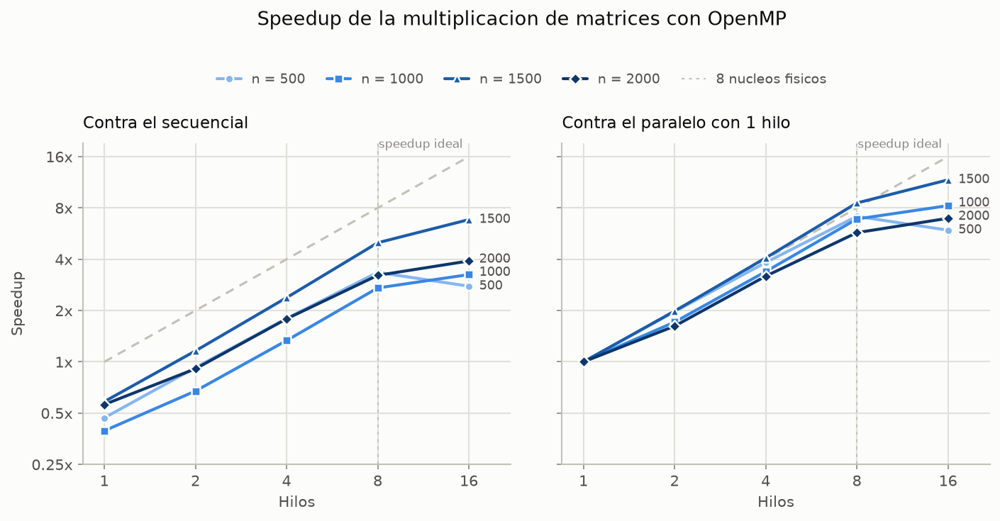

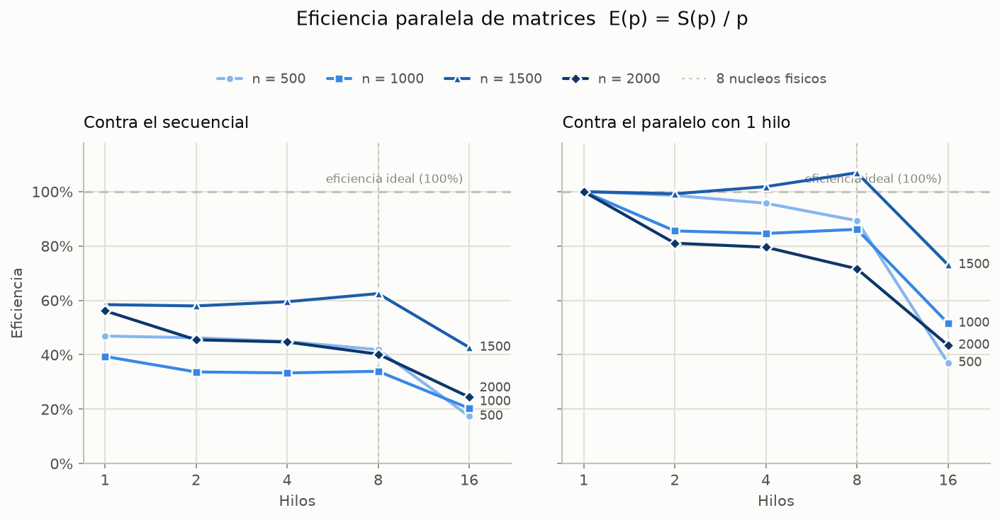

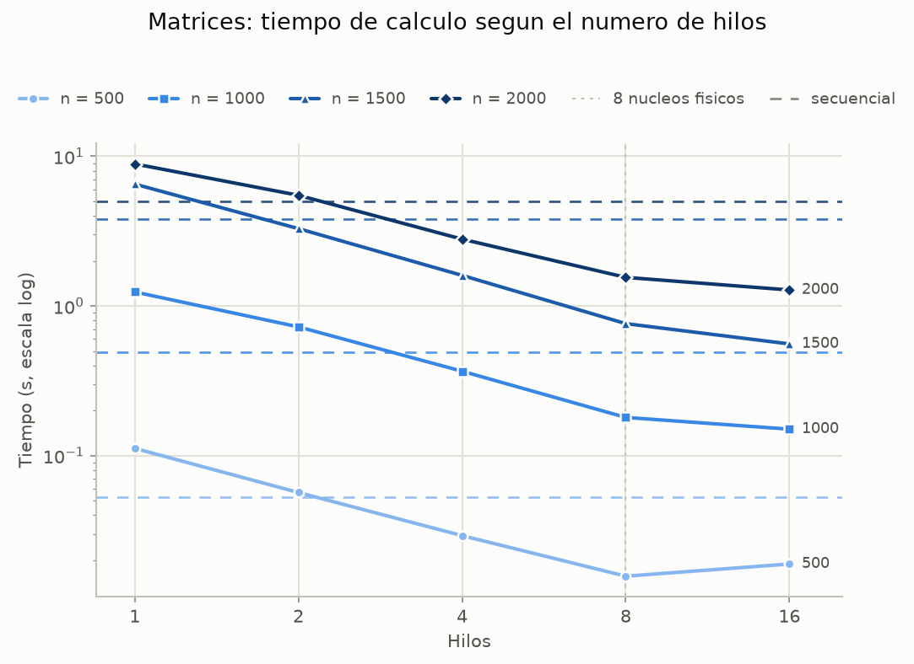

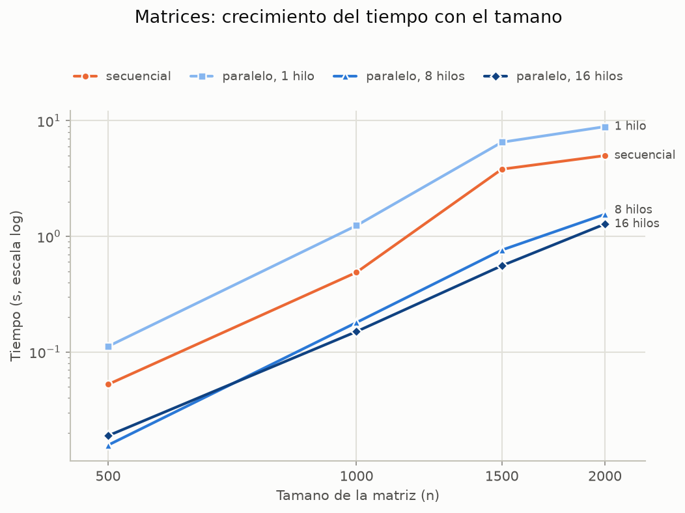

### Suma de Riemann

| \(f(x)\) | Rectángulos | Hilos | \(T_{sec}\) (s) | \(T_{par}\) (s) | \(S_{sec}\) | \(S_{omp}\) | \(E_{omp}\) |
|---|---|---|---|---|---|---|---|
| \(x^2\) | 100,000,000 | 1 | 0.1098 | 0.0810 | 1.36x | 1.00x | 100% |
| \(x^2\) | 100,000,000 | 2 | 0.1098 | 0.0410 | 2.68x | 1.98x | 99% |
| \(x^2\) | 100,000,000 | 4 | 0.1098 | 0.0225 | 4.87x | 3.59x | 90% |
| \(x^2\) | 100,000,000 | 8 | 0.1098 | 0.0170 | 6.45x | 4.76x | 59% |
| \(x^2\) | 100,000,000 | 16 | 0.1098 | 0.0111 | 9.90x | 7.30x | 46% |
| \(x^2\) | 500,000,000 | 1 | 0.5063 | 0.3970 | 1.28x | 1.00x | 100% |
| \(x^2\) | 500,000,000 | 2 | 0.5063 | 0.2052 | 2.47x | 1.93x | 97% |
| \(x^2\) | 500,000,000 | 4 | 0.5063 | 0.1016 | 4.99x | 3.91x | 98% |
| \(x^2\) | 500,000,000 | 8 | 0.5063 | 0.0754 | 6.72x | 5.27x | 66% |
| \(x^2\) | 500,000,000 | 16 | 0.5063 | 0.0444 | 11.40x | 8.94x | 56% |
| \(x^2\) | 1,000,000,000 | 1 | 1.0525 | 0.7700 | 1.37x | 1.00x | 100% |
| \(x^2\) | 1,000,000,000 | 2 | 1.0525 | 0.3943 | 2.67x | 1.95x | 98% |
| \(x^2\) | 1,000,000,000 | 4 | 1.0525 | 0.2004 | 5.25x | 3.84x | 96% |
| \(x^2\) | 1,000,000,000 | 8 | 1.0525 | 0.1118 | 9.41x | 6.89x | 86% |
| \(x^2\) | 1,000,000,000 | 16 | 1.0525 | 0.0885 | 11.89x | 8.70x | 54% |
| \(\sin x\) | 100,000,000 | 1 | 0.7994 | 0.7921 | 1.01x | 1.00x | 100% |
| \(\sin x\) | 100,000,000 | 2 | 0.7994 | 0.4141 | 1.93x | 1.91x | 96% |
| \(\sin x\) | 100,000,000 | 4 | 0.7994 | 0.2088 | 3.83x | 3.79x | 95% |
| \(\sin x\) | 100,000,000 | 8 | 0.7994 | 0.1270 | 6.30x | 6.24x | 78% |
| \(\sin x\) | 100,000,000 | 16 | 0.7994 | 0.1168 | 6.85x | 6.78x | 42% |
| \(\sin x\) | 500,000,000 | 1 | 3.9933 | 3.9427 | 1.01x | 1.00x | 100% |
| \(\sin x\) | 500,000,000 | 2 | 3.9933 | 2.1479 | 1.86x | 1.84x | 92% |
| \(\sin x\) | 500,000,000 | 4 | 3.9933 | 1.1094 | 3.60x | 3.55x | 89% |
| \(\sin x\) | 500,000,000 | 8 | 3.9933 | 0.6317 | 6.32x | 6.24x | 78% |
| \(\sin x\) | 500,000,000 | 16 | 3.9933 | 0.5526 | 7.23x | 7.13x | 45% |
| \(\sin x\) | 1,000,000,000 | 1 | 8.2302 | 8.0664 | 1.02x | 1.00x | 100% |
| \(\sin x\) | 1,000,000,000 | 2 | 8.2302 | 4.3554 | 1.89x | 1.85x | 93% |
| \(\sin x\) | 1,000,000,000 | 4 | 8.2302 | 2.3029 | 3.57x | 3.50x | 88% |
| \(\sin x\) | 1,000,000,000 | 8 | 8.2302 | 1.3583 | 6.06x | 5.94x | 74% |
| \(\sin x\) | 1,000,000,000 | 16 | 8.2302 | 1.1935 | 6.90x | 6.76x | 42% |

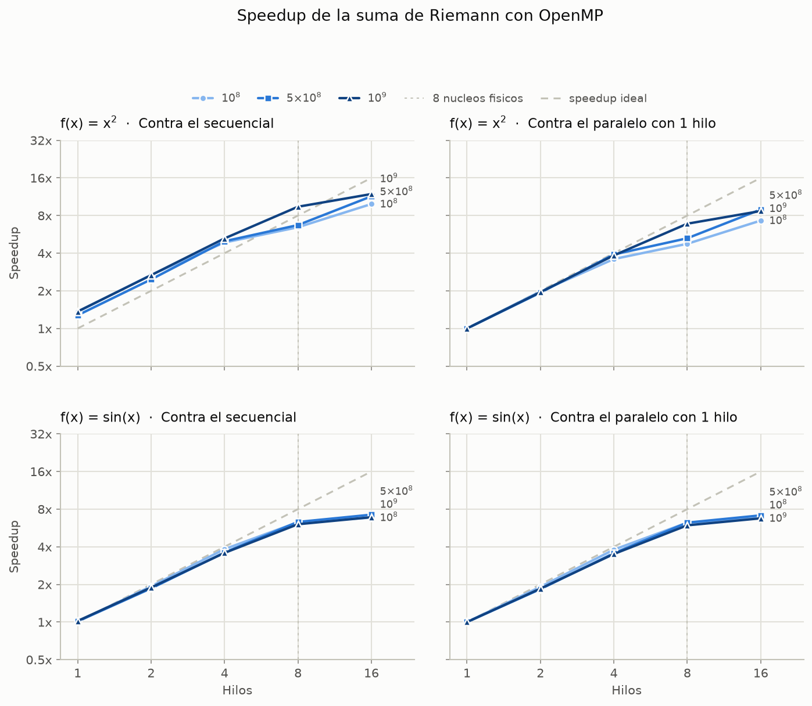

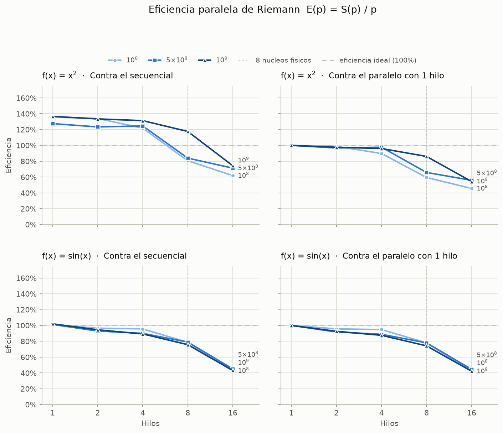

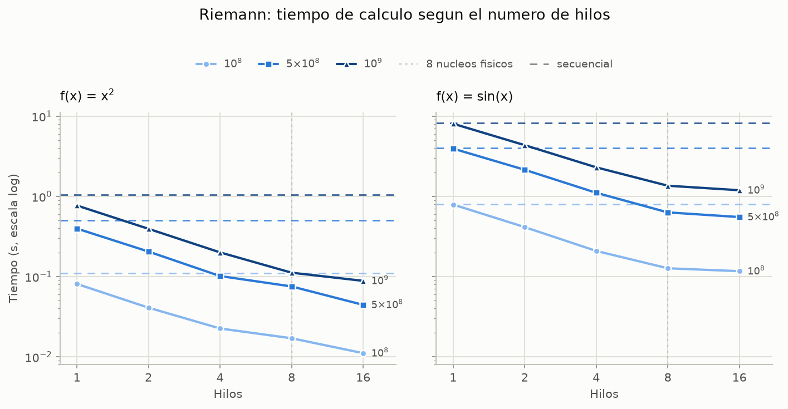

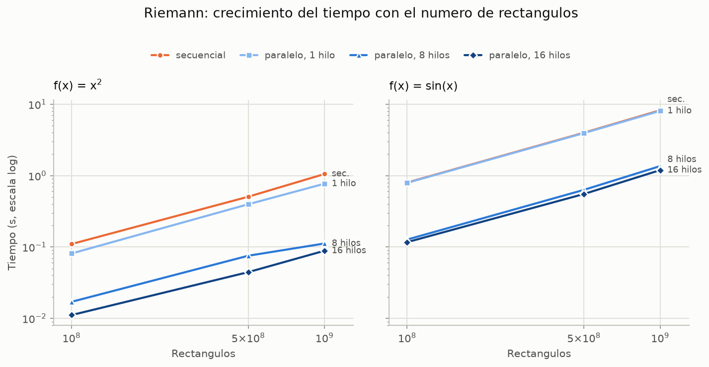

### Evidencia de ejecución

Resumen emitido por el script al finalizar el barrido:

```
MATRICES, con el maximo de hilos:
  n=500                  speedup vs sec  2.78x   vs par-1hilo  5.92x   eficiencia  37%   |  t_par(1)/t_sec = 2.13
  n=1000                 speedup vs sec  3.25x   vs par-1hilo  8.25x   eficiencia  52%   |  t_par(1)/t_sec = 2.54
  n=1500                 speedup vs sec  6.83x   vs par-1hilo 11.69x   eficiencia  73%   |  t_par(1)/t_sec = 1.71
  n=2000                 speedup vs sec  3.91x   vs par-1hilo  6.96x   eficiencia  43%   |  t_par(1)/t_sec = 1.78

RIEMANN, con el maximo de hilos:
  funcion=1, n=100000000  speedup vs sec  9.90x   vs par-1hilo  7.30x   eficiencia  46%   |  t_par(1)/t_sec = 0.74
  funcion=1, n=500000000  speedup vs sec 11.40x   vs par-1hilo  8.94x   eficiencia  56%   |  t_par(1)/t_sec = 0.78
  funcion=1, n=1000000000 speedup vs sec 11.89x   vs par-1hilo  8.70x   eficiencia  54%   |  t_par(1)/t_sec = 0.73
  funcion=3, n=100000000  speedup vs sec  6.85x   vs par-1hilo  6.78x   eficiencia  42%   |  t_par(1)/t_sec = 0.99
  funcion=3, n=500000000  speedup vs sec  7.23x   vs par-1hilo  7.13x   eficiencia  45%   |  t_par(1)/t_sec = 0.99
  funcion=3, n=1000000000 speedup vs sec  6.90x   vs par-1hilo  6.76x   eficiencia  42%   |  t_par(1)/t_sec = 0.98
```

Las 300 ejecuciones individuales quedaron registradas en `resultados_ricardo/metricas_crudas_matrices.csv` y `resultados_ricardo/metricas_crudas_riemann.csv`, con el resultado de validación de cada una.


### Análisis

El resultado más consistente es que **la eficiencia se desploma al superar los 8 hilos**, cifra que coincide exactamente con el número de núcleos físicos del procesador. En la multiplicación de matrices de \(1500 \times 1500\) la eficiencia pasa de 107 % con 8 hilos a 73 % con 16; en la suma de Riemann con \(10^9\) rectángulos, de 86 % a 54 %. El comportamiento se repite en los dos problemas, en todos los tamaños y con ambas funciones, lo que indica que se trata de una propiedad del hardware y no del algoritmo. La explicación es que los ocho hilos adicionales son lógicos y no físicos: el SMT resulta provechoso cuando un hilo permanece detenido esperando memoria y otro puede ocupar las unidades de ejecución libres, situación que no se presenta en estos ciclos, densos en operaciones aritméticas, donde ambos hilos lógicos compiten por las mismas unidades.

En cuanto al tamaño del problema, el speedup mejora conforme aumenta la carga, hasta cierto punto. El costo de crear y sincronizar el equipo de hilos es aproximadamente constante, de modo que cuanto mayor sea el trabajo asignado a cada hilo, mejor se amortiza. El caso de matrices de \(500 \times 500\) lo ilustra con claridad: con 16 hilos el tiempo absoluto (0.0189 s) resulta superior al obtenido con 8 (0.0156 s), es decir, agregar hilos empeora el desempeño. Existe por tanto un tamaño mínimo por debajo del cual paralelizar no compensa.

Se observan eficiencias superiores al 100 %, o speedup superlineal, en las matrices de \(1500 \times 1500\) con 4 y 8 hilos. No se trata de un error de medición sino de un efecto de caché: al repartir las filas, cada hilo opera sobre un bloque de datos que sí cabe en su caché privada, mientras que un hilo único recorre la matriz completa y desaloja continuamente su contenido. La suma de Riemann no exhibe este fenómeno, lo cual es coherente, ya que no manipula ningún arreglo que pueda repartirse de esa manera.

El caso de \(2000 \times 2000\) se aparta de la tendencia, con una eficiencia de 72 % frente al 107 % obtenido con \(1500 \times 1500\). La causa se verificó midiendo tamaños vecinos: el ciclo interno recorre `matriz_b[r][j]` por columnas, con un salto de \(n \times 4\) bytes entre accesos consecutivos, y cuando ese salto resulta múltiplo de potencias de dos grandes, las filas de una misma columna se asignan al mismo conjunto de caché y se expulsan entre sí. El efecto es pronunciado: con \(n = 2048\) el tiempo secuencial alcanza 19.3 s, frente a los 4.3 s que predice el crecimiento \(O(n^3)\). Se trata de una limitación del patrón de acceso a memoria y no del esquema de paralelización.

Finalmente, la comparación entre ambos problemas resulta ilustrativa. La suma de Riemann alcanza speedups superiores frente al secuencial, hasta 11.89x con \(f(x) = x^2\), pero ello se debe en parte a la vectorización adicional que habilita la cláusula `reduction`. Medida en términos de escalabilidad estricta, la multiplicación de matrices escala mejor (107 % de eficiencia con 8 hilos frente a 86 %), aunque ese margen incluye el beneficio de caché descrito anteriormente. Ambas cifras son legítimas siempre que se declare qué está midiendo cada una.

---

## Integrante: Ian Rodrigo Cumes Valdez

**Equipo de pruebas:** Intel Core i9-13900H de 13.ª generación, 14 núcleos físicos y 20 hilos lógicos, compilador MinGW-w64 GCC 16.1.0 sobre Windows de 64 bits (build 26200). Este procesador utiliza una arquitectura híbrida de núcleos de rendimiento y de eficiencia, por lo que los 14 núcleos físicos no tienen todos la misma capacidad de cómputo.

### Multiplicación de matrices

| \(n\) | Hilos | \(T_{sec}\) (s) | \(T_{par}\) (s) | \(S_{sec}\) | \(S_{omp}\) | \(E_{omp}\) |
|---|---|---|---|---|---|---|
| 500 | 1 | 0.028 | 0.049 | 0.57x | 1.00x | 100% |
| 500 | 2 | 0.028 | 0.025 | 1.12x | 1.96x | 98% |
| 500 | 4 | 0.028 | 0.013 | 2.15x | 3.77x | 94% |
| 500 | 8 | 0.028 | 0.011 | 2.55x | 4.45x | 56% |
| 500 | 16 | 0.028 | 0.008 | 3.50x | 6.12x | 38% |
| 1000 | 1 | 0.269 | 0.482 | 0.56x | 1.00x | 100% |
| 1000 | 2 | 0.269 | 0.238 | 1.13x | 2.03x | 101% |
| 1000 | 4 | 0.269 | 0.133 | 2.02x | 3.62x | 91% |
| 1000 | 8 | 0.269 | 0.095 | 2.83x | 5.07x | 63% |
| 1000 | 16 | 0.269 | 0.088 | 3.06x | 5.48x | 34% |
| 1500 | 1 | 1.295 | 2.364 | 0.55x | 1.00x | 100% |
| 1500 | 2 | 1.295 | 1.118 | 1.16x | 2.11x | 106% |
| 1500 | 4 | 1.295 | 0.555 | 2.33x | 4.26x | 106% |
| 1500 | 8 | 1.295 | 0.489 | 2.65x | 4.83x | 60% |
| 1500 | 16 | 1.295 | 0.578 | 2.24x | 4.09x | 26% |
| 2000 | 1 | 5.248 | 16.464 | 0.32x | 1.00x | 100% |
| 2000 | 2 | 5.248 | 8.060 | 0.65x | 2.04x | 102% |
| 2000 | 4 | 5.248 | 4.023 | 1.30x | 4.09x | 102% |
| 2000 | 8 | 5.248 | 2.882 | 1.82x | 5.71x | 71% |
| 2000 | 16 | 5.248 | 1.980 | 2.65x | 8.32x | 52% |

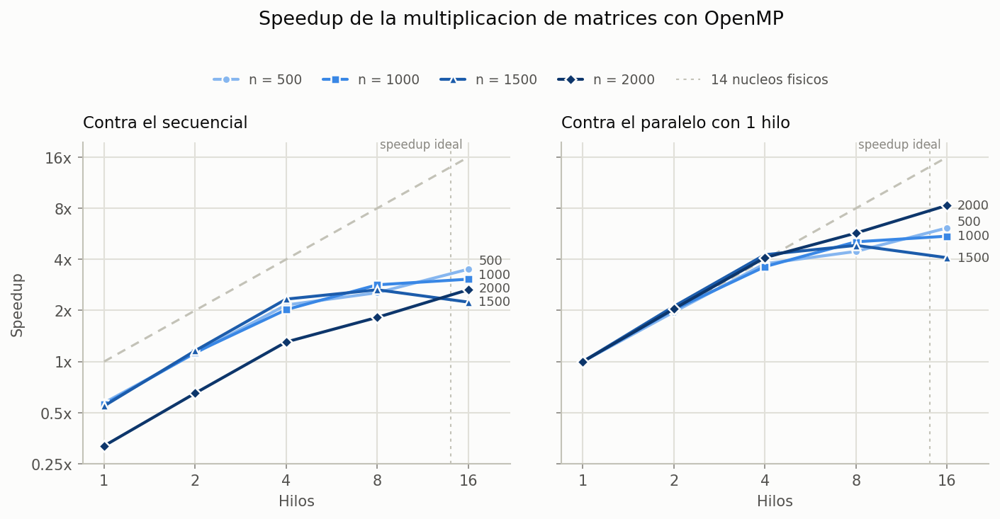

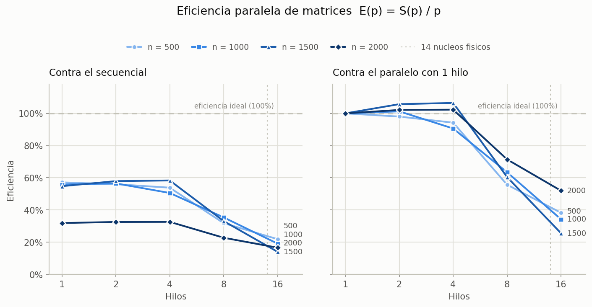

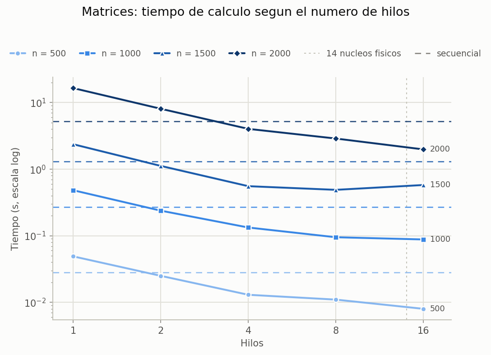

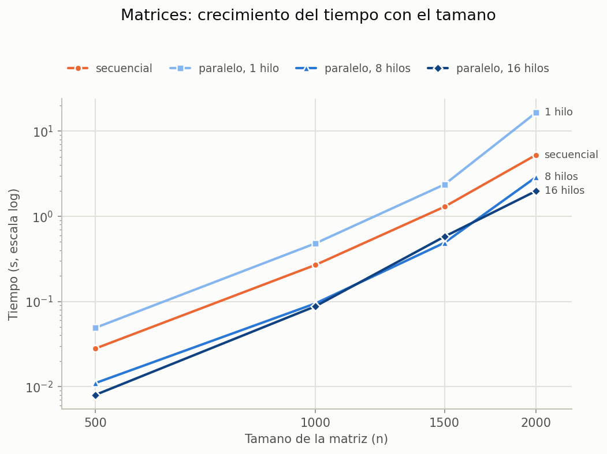

### Suma de Riemann

| \(f(x)\) | Rectángulos | Hilos | \(T_{sec}\) (s) | \(T_{par}\) (s) | \(S_{sec}\) | \(S_{omp}\) | \(E_{omp}\) |
|---|---|---|---|---|---|---|---|
| \(x^2\) | 100,000,000 | 1 | 0.067 | 0.060 | 1.12x | 1.00x | 100% |
| \(x^2\) | 100,000,000 | 2 | 0.067 | 0.030 | 2.23x | 2.00x | 100% |
| \(x^2\) | 100,000,000 | 4 | 0.067 | 0.017 | 3.94x | 3.53x | 88% |
| \(x^2\) | 100,000,000 | 8 | 0.067 | 0.012 | 5.58x | 5.00x | 62% |
| \(x^2\) | 100,000,000 | 16 | 0.067 | 0.007 | 9.57x | 8.57x | 54% |
| \(x^2\) | 500,000,000 | 1 | 0.316 | 0.276 | 1.14x | 1.00x | 100% |
| \(x^2\) | 500,000,000 | 2 | 0.316 | 0.145 | 2.18x | 1.90x | 95% |
| \(x^2\) | 500,000,000 | 4 | 0.316 | 0.078 | 4.05x | 3.54x | 88% |
| \(x^2\) | 500,000,000 | 8 | 0.316 | 0.062 | 5.10x | 4.45x | 56% |
| \(x^2\) | 500,000,000 | 16 | 0.316 | 0.041 | 7.71x | 6.73x | 42% |
| \(x^2\) | 1,000,000,000 | 1 | 0.625 | 0.560 | 1.12x | 1.00x | 100% |
| \(x^2\) | 1,000,000,000 | 2 | 0.625 | 0.291 | 2.15x | 1.92x | 96% |
| \(x^2\) | 1,000,000,000 | 4 | 0.625 | 0.161 | 3.88x | 3.48x | 87% |
| \(x^2\) | 1,000,000,000 | 8 | 0.625 | 0.117 | 5.34x | 4.79x | 60% |
| \(x^2\) | 1,000,000,000 | 16 | 0.625 | 0.080 | 7.81x | 7.00x | 44% |
| \(\sin x\) | 100,000,000 | 1 | 0.281 | 0.270 | 1.04x | 1.00x | 100% |
| \(\sin x\) | 100,000,000 | 2 | 0.281 | 0.187 | 1.50x | 1.44x | 72% |
| \(\sin x\) | 100,000,000 | 4 | 0.281 | 0.139 | 2.02x | 1.94x | 49% |
| \(\sin x\) | 100,000,000 | 8 | 0.281 | 0.081 | 3.47x | 3.33x | 42% |
| \(\sin x\) | 100,000,000 | 16 | 0.281 | 0.056 | 5.02x | 4.82x | 30% |
| \(\sin x\) | 500,000,000 | 1 | 1.395 | 1.367 | 1.02x | 1.00x | 100% |
| \(\sin x\) | 500,000,000 | 2 | 1.395 | 0.911 | 1.53x | 1.50x | 75% |
| \(\sin x\) | 500,000,000 | 4 | 1.395 | 0.664 | 2.10x | 2.06x | 51% |
| \(\sin x\) | 500,000,000 | 8 | 1.395 | 0.396 | 3.52x | 3.45x | 43% |
| \(\sin x\) | 500,000,000 | 16 | 1.395 | 0.276 | 5.05x | 4.95x | 31% |
| \(\sin x\) | 1,000,000,000 | 1 | 2.773 | 2.690 | 1.03x | 1.00x | 100% |
| \(\sin x\) | 1,000,000,000 | 2 | 2.773 | 1.783 | 1.56x | 1.51x | 75% |
| \(\sin x\) | 1,000,000,000 | 4 | 2.773 | 1.328 | 2.09x | 2.03x | 51% |
| \(\sin x\) | 1,000,000,000 | 8 | 2.773 | 0.813 | 3.41x | 3.31x | 41% |
| \(\sin x\) | 1,000,000,000 | 16 | 2.773 | 0.548 | 5.06x | 4.91x | 31% |

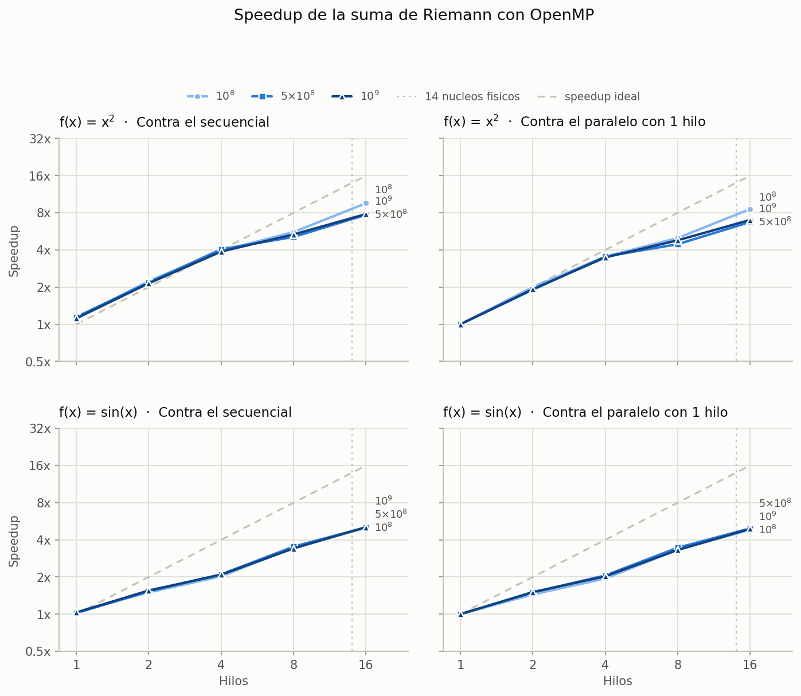

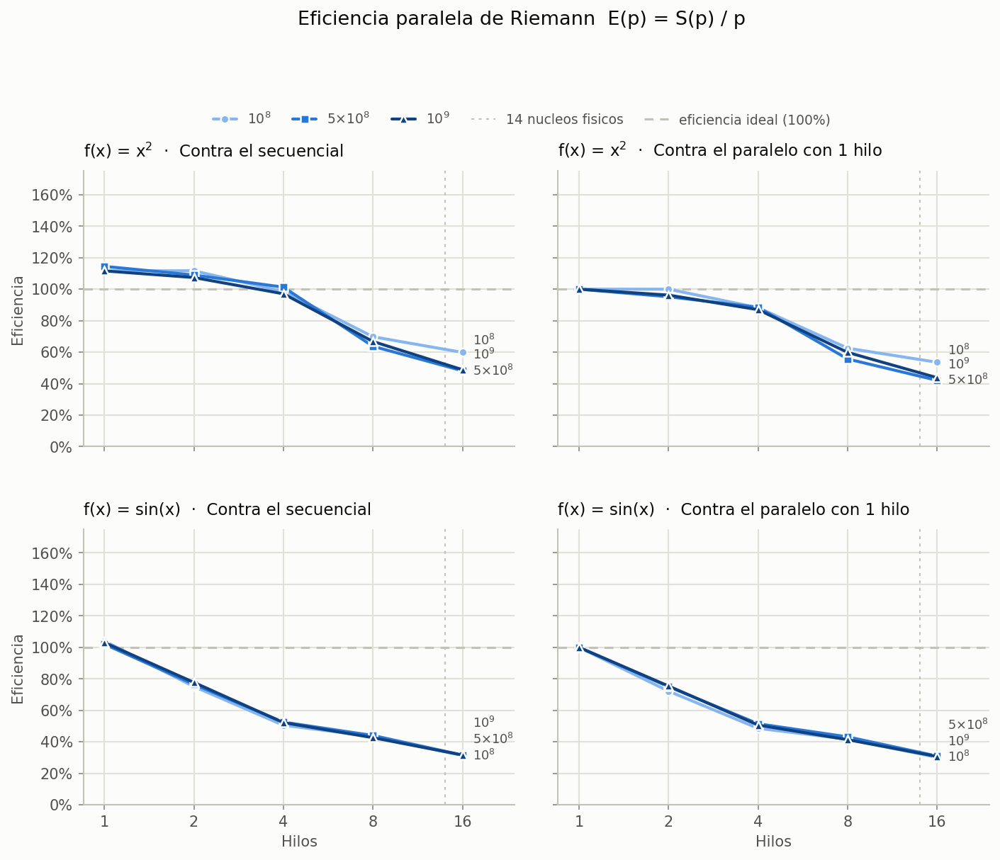

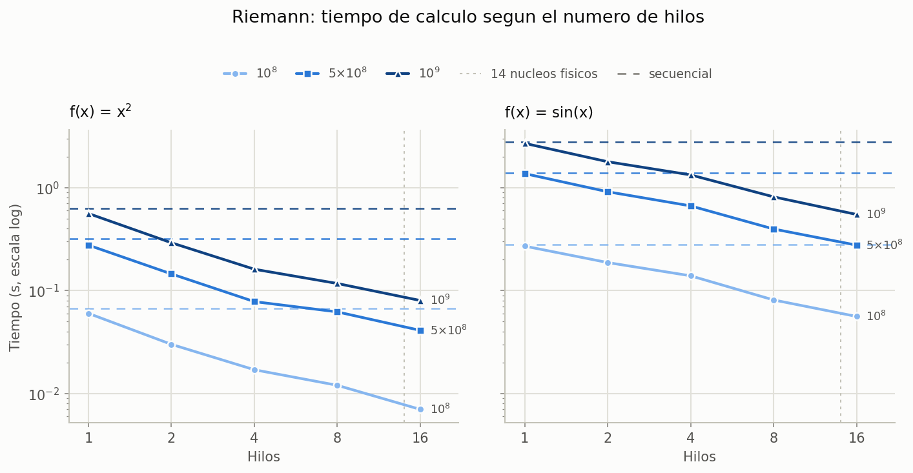

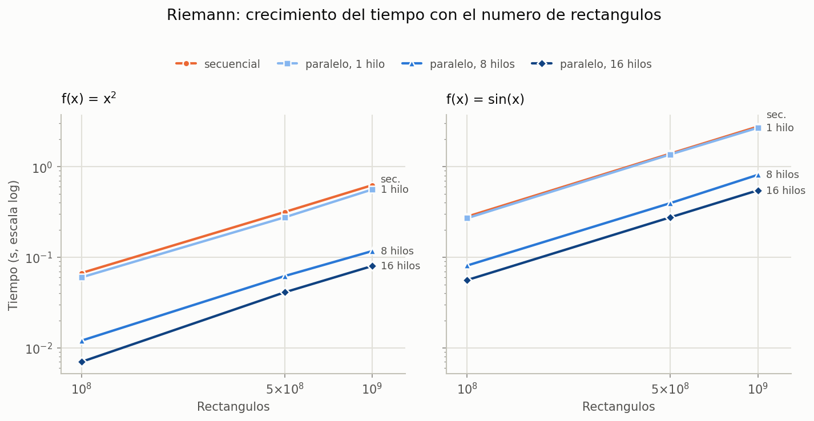

### Evidencia de ejecución

El barrido completó las 300 ejecuciones previstas: 120 para matrices y 180 para Riemann. Los checksums de matrices coincidieron exactamente en todas las configuraciones y todas las áreas de Riemann permanecieron dentro de la tolerancia relativa de \(10^{-9}\). Las mediciones individuales y los resúmenes se conservaron en `resultados_ian/metricas_crudas_matrices.csv`, `resultados_ian/metricas_crudas_riemann.csv`, `resultados_ian/metricas_matrices.csv` y `resultados_ian/metricas_riemann.csv`.

Resumen emitido por el script para las configuraciones de 16 hilos:

```
MATRICES, con el maximo de hilos:
  n=500                  speedup vs sec  3.50x   vs par-1hilo  6.12x   eficiencia  38%
  n=1000                 speedup vs sec  3.06x   vs par-1hilo  5.48x   eficiencia  34%
  n=1500                 speedup vs sec  2.24x   vs par-1hilo  4.09x   eficiencia  26%
  n=2000                 speedup vs sec  2.65x   vs par-1hilo  8.32x   eficiencia  52%

RIEMANN, con el maximo de hilos:
  funcion=1, n=100000000  speedup vs sec  9.57x   vs par-1hilo  8.57x   eficiencia  54%
  funcion=1, n=500000000  speedup vs sec  7.71x   vs par-1hilo  6.73x   eficiencia  42%
  funcion=1, n=1000000000 speedup vs sec  7.81x   vs par-1hilo  7.00x   eficiencia  44%
  funcion=3, n=100000000  speedup vs sec  5.02x   vs par-1hilo  4.82x   eficiencia  30%
  funcion=3, n=500000000  speedup vs sec  5.05x   vs par-1hilo  4.95x   eficiencia  31%
  funcion=3, n=1000000000 speedup vs sec  5.06x   vs par-1hilo  4.91x   eficiencia  31%
```

### Análisis

En la multiplicación de matrices, la escalabilidad de OpenMP es cercana o incluso ligeramente superior a la ideal hasta cuatro hilos para los tamaños de 1000 a 2000. A partir de ocho hilos la eficiencia disminuye de forma marcada. El caso de \(n=2000\), que ofrece la carga más representativa, obtiene un speedup \(S_{omp}\) de 5.71x con ocho hilos y de 8.32x con 16, equivalentes a eficiencias de 71 % y 52 %. La carga de \(1500 \times 1500\) muestra además una saturación clara: pasa de 0.489 s con ocho hilos a 0.578 s con 16, por lo que agregar hilos empeora el tiempo en esa configuración.

El speedup formal de matrices frente al secuencial es menor que la escalabilidad medida desde el paralelo con un hilo. Para \(n=2000\), por ejemplo, \(S_{sec}\) es 2.65x mientras \(S_{omp}\) alcanza 8.32x. La causa es que la versión OpenMP con un hilo tarda 16.464 s frente a 5.248 s de la secuencial. Esto concuerda con el efecto descrito anteriormente: la región paralela inhibe una optimización SIMD que sí aprovecha el compilador en la versión secuencial, de modo que el paralelismo debe compensar primero esa desventaja.

La suma de Riemann presenta un comportamiento más regular. Con \(f(x)=x^2\) y \(10^9\) rectángulos, el tiempo baja de 0.625 s en la versión secuencial a 0.080 s con 16 hilos, un speedup formal de 7.81x. La eficiencia \(E_{omp}\) es 87 % con cuatro hilos, 60 % con ocho y 44 % con 16. La versión OpenMP con un hilo es alrededor de 10 % más rápida que la secuencial porque `reduction` permite reasociar y vectorizar la suma; por eso \(S_{sec}\) supera a \(S_{omp}\) en esta función.

Con \(f(x)=\sin x\), la versión secuencial de \(10^9\) rectángulos tarda 2.773 s y la paralela con 16 hilos 0.548 s, para un speedup formal de 5.06x. Aquí no aparece la ventaja de vectorización: los tiempos secuencial y paralelo con un hilo son casi iguales. La eficiencia cae a aproximadamente 51 % con cuatro hilos, 41 % con ocho y 31 % con 16, patrón que se repite en los tres tamaños y sugiere que la llamada a `sin()` y la administración de la ejecución limitan la escalabilidad antes que en el caso de \(x^2\).

El punto exacto de saturación no puede asociarse de manera directa con los 14 núcleos físicos porque el barrido solo evaluó 8 y 16 hilos alrededor de ese límite. Además, el i9-13900H combina núcleos de rendimiento y de eficiencia, y únicamente los primeros ofrecen hilos lógicos adicionales; por ello, aumentar el número de hilos no añade capacidad homogénea. Los resultados sí muestran que con 16 hilos, dos más que los núcleos físicos, el trabajo todavía se acelera en la mayoría de los casos, pero con rendimientos marginales decrecientes y eficiencias entre 26 % y 54 % según el problema. Una medición adicional con 14 hilos permitiría ubicar con mayor precisión cuánto de la caída corresponde al uso de hilos lógicos.

---

## Integrante: Diego José López Campos

**Equipo de pruebas:** Intel Core Ultra 7 255HX, 20 núcleos físicos y 20 hilos lógicos, compilador MinGW-w64 GCC 15.2.0 sobre Windows. Se evaluaron 1, 2, 4, 8 y 16 hilos; por tanto, el último punto todavía se encuentra por debajo de los 20 núcleos físicos disponibles.

### Multiplicación de matrices

| \(n\) | Hilos | \(T_{sec}\) (s) | \(T_{par}\) (s) | \(S_{sec}\) | \(S_{omp}\) | \(E_{omp}\) |
|---|---|---|---|---|---|---|
| 500 | 1 | 0.018 | 0.054 | 0.33x | 1.00x | 100% |
| 500 | 2 | 0.018 | 0.028 | 0.64x | 1.93x | 96% |
| 500 | 4 | 0.018 | 0.014 | 1.29x | 3.86x | 96% |
| 500 | 8 | 0.018 | 0.010 | 1.80x | 5.40x | 68% |
| 500 | 16 | 0.018 | 0.008 | 2.25x | 6.75x | 42% |
| 1000 | 1 | 0.208 | 0.619 | 0.34x | 1.00x | 100% |
| 1000 | 2 | 0.208 | 0.312 | 0.67x | 1.98x | 99% |
| 1000 | 4 | 0.208 | 0.154 | 1.35x | 4.02x | 100% |
| 1000 | 8 | 0.208 | 0.090 | 2.31x | 6.88x | 86% |
| 1000 | 16 | 0.208 | 0.069 | 3.01x | 8.97x | 56% |
| 1500 | 1 | 0.788 | 2.211 | 0.36x | 1.00x | 100% |
| 1500 | 2 | 0.788 | 1.051 | 0.75x | 2.10x | 105% |
| 1500 | 4 | 0.788 | 0.558 | 1.41x | 3.96x | 99% |
| 1500 | 8 | 0.788 | 0.319 | 2.47x | 6.93x | 87% |
| 1500 | 16 | 0.788 | 0.226 | 3.49x | 9.78x | 61% |
| 2000 | 1 | 3.141 | 9.800 | 0.32x | 1.00x | 100% |
| 2000 | 2 | 3.141 | 4.918 | 0.64x | 1.99x | 100% |
| 2000 | 4 | 3.141 | 2.454 | 1.28x | 3.99x | 100% |
| 2000 | 8 | 3.141 | 1.225 | 2.56x | 8.00x | 100% |
| 2000 | 16 | 3.141 | 0.722 | 4.35x | 13.57x | 85% |

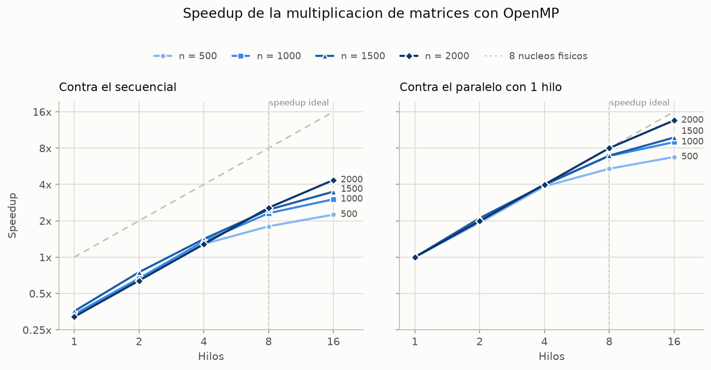

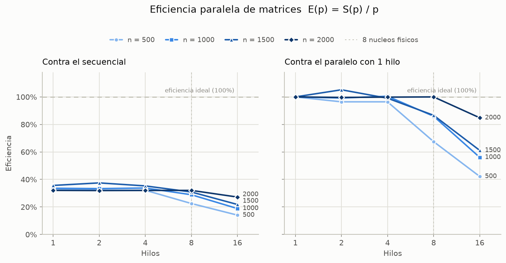

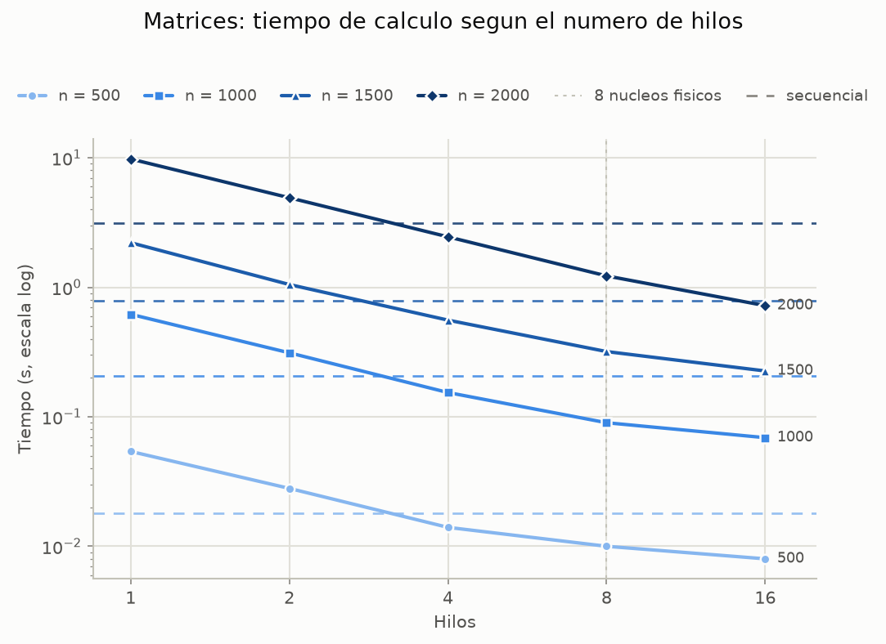

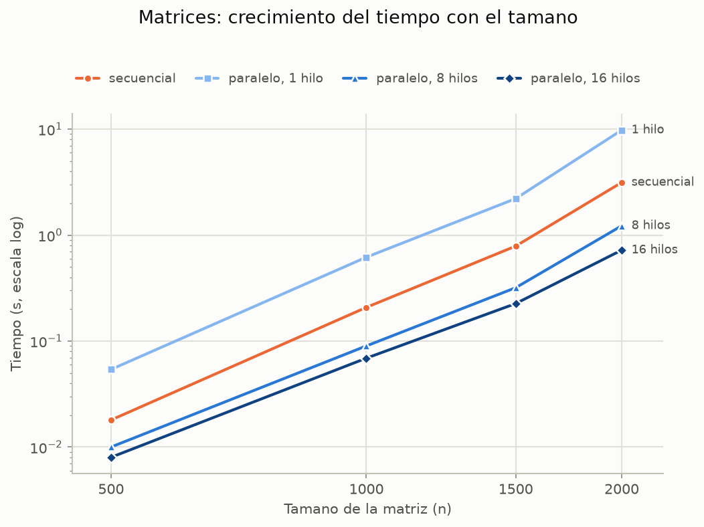

### Suma de Riemann

| \(f(x)\) | Rectángulos | Hilos | \(T_{sec}\) (s) | \(T_{par}\) (s) | \(S_{sec}\) | \(S_{omp}\) | \(E_{omp}\) |
|---|---|---|---|---|---|---|---|
| \(x^2\) | 100,000,000 | 1 | 0.049 | 0.050 | 0.98x | 1.00x | 100% |
| \(x^2\) | 100,000,000 | 2 | 0.049 | 0.026 | 1.88x | 1.92x | 96% |
| \(x^2\) | 100,000,000 | 4 | 0.049 | 0.012 | 4.08x | 4.17x | 104% |
| \(x^2\) | 100,000,000 | 8 | 0.049 | 0.009 | 5.44x | 5.56x | 69% |
| \(x^2\) | 100,000,000 | 16 | 0.049 | 0.008 | 6.13x | 6.25x | 39% |
| \(x^2\) | 500,000,000 | 1 | 0.253 | 0.247 | 1.02x | 1.00x | 100% |
| \(x^2\) | 500,000,000 | 2 | 0.253 | 0.129 | 1.96x | 1.91x | 96% |
| \(x^2\) | 500,000,000 | 4 | 0.253 | 0.065 | 3.89x | 3.80x | 95% |
| \(x^2\) | 500,000,000 | 8 | 0.253 | 0.040 | 6.33x | 6.18x | 77% |
| \(x^2\) | 500,000,000 | 16 | 0.253 | 0.032 | 7.91x | 7.72x | 48% |
| \(x^2\) | 1,000,000,000 | 1 | 0.509 | 0.489 | 1.04x | 1.00x | 100% |
| \(x^2\) | 1,000,000,000 | 2 | 0.509 | 0.254 | 2.00x | 1.93x | 96% |
| \(x^2\) | 1,000,000,000 | 4 | 0.509 | 0.129 | 3.95x | 3.79x | 95% |
| \(x^2\) | 1,000,000,000 | 8 | 0.509 | 0.079 | 6.44x | 6.19x | 77% |
| \(x^2\) | 1,000,000,000 | 16 | 0.509 | 0.058 | 8.78x | 8.43x | 53% |
| \(\sin x\) | 100,000,000 | 1 | 0.247 | 0.189 | 1.31x | 1.00x | 100% |
| \(\sin x\) | 100,000,000 | 2 | 0.247 | 0.120 | 2.06x | 1.58x | 79% |
| \(\sin x\) | 100,000,000 | 4 | 0.247 | 0.086 | 2.87x | 2.20x | 55% |
| \(\sin x\) | 100,000,000 | 8 | 0.247 | 0.052 | 4.75x | 3.63x | 45% |
| \(\sin x\) | 100,000,000 | 16 | 0.247 | 0.034 | 7.26x | 5.56x | 35% |
| \(\sin x\) | 500,000,000 | 1 | 1.288 | 0.955 | 1.35x | 1.00x | 100% |
| \(\sin x\) | 500,000,000 | 2 | 1.288 | 0.594 | 2.17x | 1.61x | 80% |
| \(\sin x\) | 500,000,000 | 4 | 1.288 | 0.422 | 3.05x | 2.26x | 57% |
| \(\sin x\) | 500,000,000 | 8 | 1.288 | 0.251 | 5.13x | 3.80x | 48% |
| \(\sin x\) | 500,000,000 | 16 | 1.288 | 0.161 | 8.00x | 5.93x | 37% |
| \(\sin x\) | 1,000,000,000 | 1 | 2.478 | 1.923 | 1.29x | 1.00x | 100% |
| \(\sin x\) | 1,000,000,000 | 2 | 2.478 | 1.190 | 2.08x | 1.62x | 81% |
| \(\sin x\) | 1,000,000,000 | 4 | 2.478 | 0.847 | 2.93x | 2.27x | 57% |
| \(\sin x\) | 1,000,000,000 | 8 | 2.478 | 0.501 | 4.95x | 3.84x | 48% |
| \(\sin x\) | 1,000,000,000 | 16 | 2.478 | 0.314 | 7.89x | 6.12x | 38% |

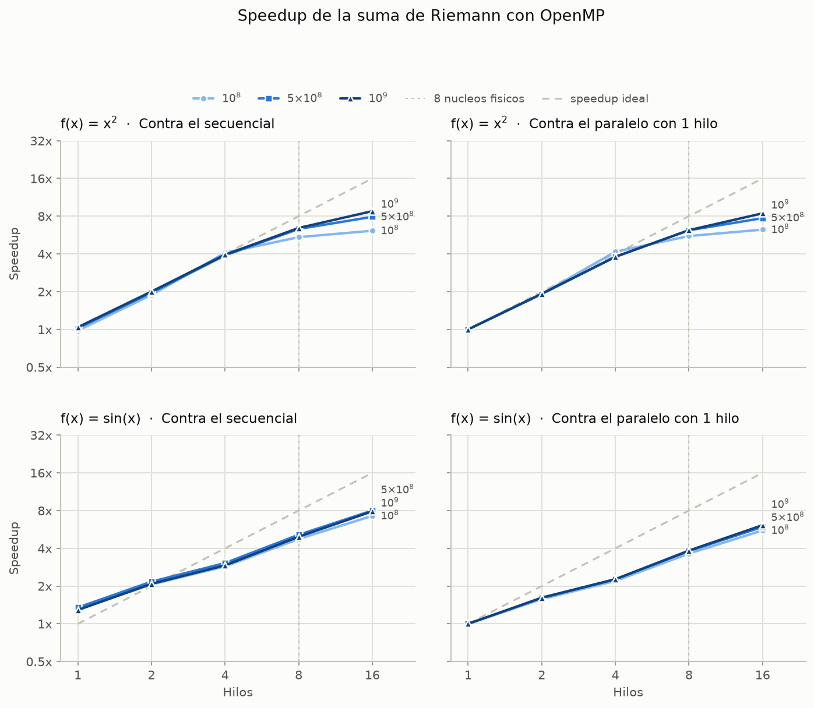

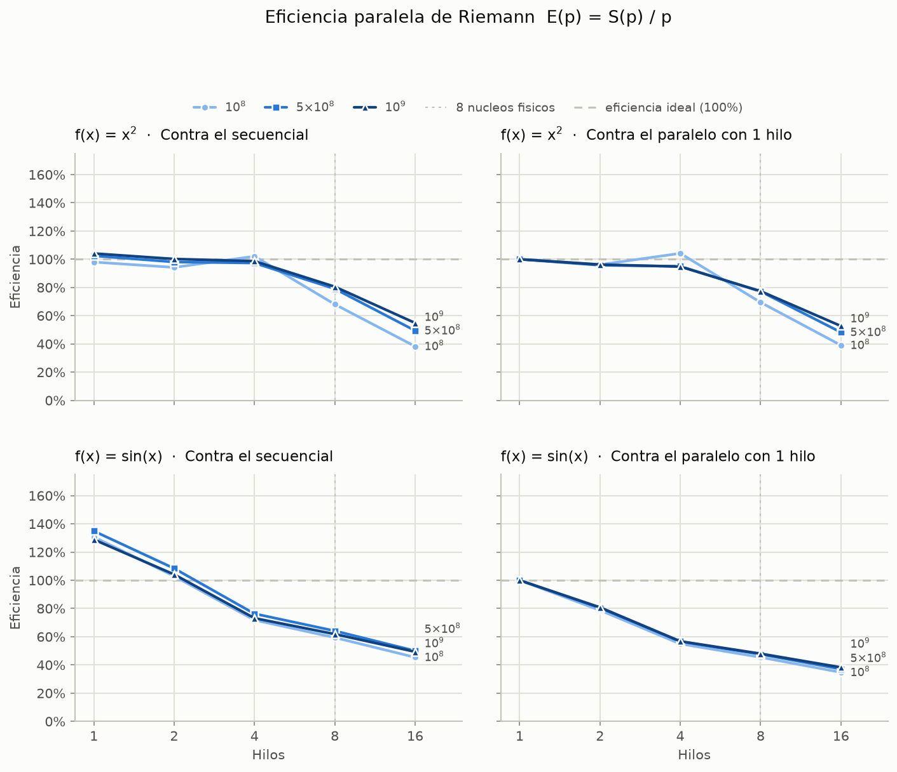

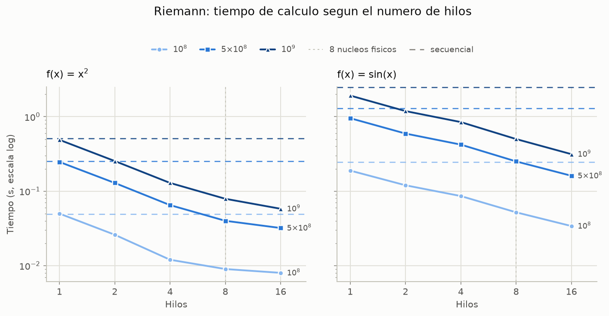

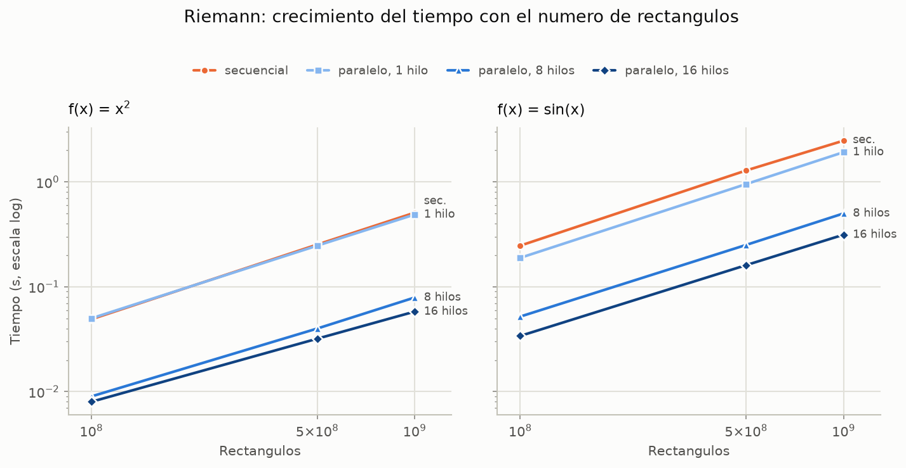

### Evidencia de ejecución

El barrido completó las 300 ejecuciones: 120 para matrices y 180 para Riemann. Los checksums de matrices coincidieron exactamente en todas las configuraciones y las áreas de Riemann permanecieron dentro de la tolerancia relativa de \(10^{-9}\). Los datos crudos y los resúmenes reproducibles se encuentran en `resultados_diego/metricas_crudas_matrices.csv`, `resultados_diego/metricas_crudas_riemann.csv`, `resultados_diego/metricas_matrices.csv` y `resultados_diego/metricas_riemann.csv`.

### Análisis

En matrices, la escalabilidad de OpenMP es muy buena al usar como referencia la versión paralela con un hilo: para \(n=2000\), el speedup \(S_{omp}\) llega a 13.57x con 16 hilos, equivalente a 85 % de eficiencia. El equipo aún dispone de 20 núcleos físicos, por lo que esta medición no alcanza el punto donde sería esperable observar saturación por falta de núcleos. En cambio, para \(n=500\) la eficiencia cae hasta 42 % con 16 hilos: el trabajo es demasiado pequeño para amortizar completamente la creación, sincronización y coordinación de los hilos.

El speedup formal de matrices frente al secuencial, \(S_{sec}\), alcanza 4.35x para \(n=2000\) y 16 hilos. Es sustancialmente menor que \(S_{omp}\) porque la versión paralela con un hilo tarda más que la secuencial en esta configuración (9.800 s frente a 3.141 s); por ello, ambas medidas se reportan y no deben confundirse. \(S_{omp}\) describe la escalabilidad del esquema OpenMP, mientras que \(S_{sec}\) compara el desempeño final contra la mejor línea base secuencial.

Para Riemann con \(x^2\), la eficiencia respecto a OpenMP se mantiene cercana a 95 % hasta cuatro hilos y baja a 53 % con 16 hilos para \(10^9\) rectángulos; el mejor speedup formal es 8.78x. Con \(\sin x\), el trabajo por iteración es más costoso, pero el speedup puramente OpenMP llega a 6.12x y la eficiencia a 38 % con 16 hilos. El speedup formal máximo de esta función es 8.00x para \(5 \times 10^8\) rectángulos. En todos los casos, la disminución de eficiencia antes de alcanzar los 20 núcleos físicos muestra que la sobrecarga de sincronización, el ancho de banda de memoria y la variación de frecuencia del procesador también limitan la escalabilidad.

---

## Comparación entre los tres equipos

Las tres mediciones se realizaron con el mismo código, las mismas banderas de compilación y la misma rejilla de configuraciones, sobre equipos deliberadamente distintos. Esa diversidad permite separar lo que depende del algoritmo de lo que depende del hardware.

| Integrante | Procesador | Núcleos físicos | Hilos lógicos | Compilador y sistema |
|---|---|---|---|---|
| Ricardo | AMD Ryzen 7 5700U | 8 | 16 (SMT) | GCC 16.2.1 sobre Linux |
| Ian | Intel Core i9-13900H | 14 (híbrido) | 20 | MinGW GCC 16.1.0 sobre Windows |
| Diego | Intel Core Ultra 7 255HX | 20 | 20 (sin SMT) | MinGW GCC 15.2.0 sobre Windows |

La siguiente tabla resume la eficiencia \(E_{omp}\) en las configuraciones de mayor carga de cada problema.

| Configuración | Equipo | 2 hilos | 4 hilos | 8 hilos | 16 hilos | \(S_{omp}\) máx. |
|---|---|---|---|---|---|---|
| Matrices \(2000 \times 2000\) | Ricardo | 81 % | 80 % | 72 % | 43 % | 6.96x |
| | Ian | 102 % | 102 % | 71 % | 52 % | 8.32x |
| | Diego | 100 % | 100 % | 100 % | 85 % | 13.57x |
| Riemann \(x^2\), \(10^9\) | Ricardo | 98 % | 96 % | 86 % | 54 % | 8.70x |
| | Ian | 96 % | 87 % | 60 % | 44 % | 7.00x |
| | Diego | 96 % | 95 % | 77 % | 53 % | 8.43x |
| Riemann \(\sin x\), \(10^9\) | Ricardo | 93 % | 88 % | 74 % | 42 % | 6.76x |
| | Ian | 75 % | 51 % | 41 % | 31 % | 4.91x |
| | Diego | 81 % | 57 % | 48 % | 38 % | 6.12x |

### Relación entre el punto de saturación y los núcleos disponibles

La hipótesis planteada era que la eficiencia se desplomaría al superar el número de núcleos físicos de cada equipo. Los tres resultados la sostienen, y lo hacen de manera complementaria porque cada máquina se sitúa en una posición distinta respecto a su propio límite.

En el equipo de Ricardo, con 8 núcleos físicos, la rejilla de medición cruza el límite justo entre los dos últimos puntos, y allí aparece la caída más nítida de las tres: en matrices de \(1500 \times 1500\) la eficiencia pasa de 107 % con 8 hilos a 73 % con 16, y en la suma de Riemann con \(x^2\), de 86 % a 54 %. El comportamiento se repite en todos los tamaños y con ambas funciones.

El equipo de Diego constituye el caso de control más informativo, ya que dispone de 20 núcleos físicos y no utiliza SMT: sus 20 hilos lógicos corresponden a 20 núcleos reales. Como el barrido llegó únicamente a 16 hilos, **esta máquina nunca alcanza su límite**, y en consecuencia no presenta el desplome. En matrices de \(2000 \times 2000\) conserva 100 % de eficiencia hasta 8 hilos y 85 % con 16, el mejor resultado del grupo, con un speedup \(S_{omp}\) de 13.57x. Que la única máquina que no cruza su límite sea también la única que no muestra el desplome es la evidencia más directa a favor de la hipótesis.

El equipo de Ian introduce un matiz importante. Su eficiencia cae **antes** de los 14 núcleos físicos: en matrices de \(1500 \times 1500\) desciende de 106 % con 4 hilos a 60 % con 8. La explicación reside en la arquitectura híbrida del i9-13900H, que combina núcleos de rendimiento con núcleos de eficiencia de menor capacidad. Sus 14 núcleos físicos no son equivalentes entre sí, de modo que el número relevante no es el total, sino la cantidad de núcleos de rendimiento disponibles. La formulación precisa de la hipótesis no es, por tanto, que el límite lo marquen los núcleos físicos, sino los **núcleos de capacidad equivalente**; en las dos máquinas homogéneas ambas cifras coinciden y en la híbrida se separan.

### Comportamiento de `schedule(static)` en arquitecturas heterogéneas

El caso de Ian expone una consecuencia de la planificación estática que no se apreciaba en los otros dos equipos. En matrices de \(1500 \times 1500\), su tiempo **aumenta** de 0.489 s con 8 hilos a 0.578 s con 16: agregar hilos degrada el desempeño en términos absolutos.

La sección de estrategia justificó `schedule(static)` argumentando que el trabajo por iteración es uniforme, lo cual es cierto respecto al algoritmo. Sin embargo, esa justificación presupone implícitamente que los núcleos que ejecutan esos bloques también lo son. Cuando no se cumple, el reparto estático asigna bloques de igual tamaño a núcleos de capacidad distinta, y los hilos que terminan antes permanecen detenidos en la barrera final esperando al bloque asignado a un núcleo de eficiencia. Este es el único escenario entre los tres donde `schedule(dynamic)` o `schedule(guided)` podría mejorar el resultado, precisamente porque reasignarían trabajo conforme los hilos quedan libres. Conviene señalarlo como un matiz a la decisión tomada, y no como un error: en hardware homogéneo, que es el caso de los otros dos equipos, la planificación estática sigue siendo la elección adecuada.

### El costo de la vectorización inhibida varía según el entorno de compilación

La pérdida de vectorización en la multiplicación de matrices se observó en los tres equipos, pero con magnitudes distintas. La razón \(T_{par}(1)/T_{sec}\) en matrices de \(2000 \times 2000\) es 1.78 en el equipo de Ricardo, 3.14 en el de Ian y 3.12 en el de Diego. En el caso de Diego la penalización se mantiene alta en todos los tamaños, entre 2.81 y 3.12, mientras que en el de Ian solo alcanza ese nivel en la carga mayor y se sitúa cerca de 1.8 en las demás.

Esta dispersión confirma la pertinencia de reportar las dos medidas de speedup. Si se hubiera empleado únicamente \(S_{sec}\), la comparación entre los tres equipos habría mezclado el efecto del paralelismo con el de las optimizaciones que cada combinación de compilador y sistema aplica a la versión secuencial, y las diferencias observadas no serían atribuibles al esquema de paralelización.

En la suma de Riemann la situación resulta menos regular de lo previsto. En el equipo de Ricardo se confirma con claridad lo expuesto en la sección de estrategia: la razón \(T_{par}(1)/T_{sec}\) es 0.73 con \(x^2\), donde la cláusula `reduction` habilita la vectorización, y 0.98 con \(\sin x\), donde la llamada a la biblioteca matemática impide aprovecharla. En el equipo de Ian el patrón se conserva de forma atenuada, con 0.90 y 0.97 respectivamente. En el de Diego, en cambio, la relación se invierte: 0.96 con \(x^2\) y 0.78 con \(\sin x\), es decir, la ganancia aparece en la función que teóricamente no debería vectorizarse. Este comportamiento no queda explicado por el análisis realizado y podría deberse a la versión del compilador, que es anterior a la de los otros dos equipos, o a la implementación de la biblioteca matemática empleada. Se documenta como una observación pendiente de verificación en lugar de forzar su encaje en la explicación general.

### Comportamientos que se reproducen en los tres equipos

Dos resultados aparecen en las tres máquinas, lo que permite atribuirlos al algoritmo y no al hardware particular de ninguna.

El primero es la eficiencia superior al 100 % en matrices de tamaño intermedio: 107 % en el equipo de Ricardo con 8 hilos, 106 % en el de Ian con 2 y 4 hilos, y 105 % en el de Diego con 2 hilos. Que el speedup superlineal se manifieste en tres arquitecturas distintas respalda la explicación basada en el efecto de caché, según la cual el reparto de filas permite que cada hilo opere sobre un bloque que sí cabe en su caché privada.

El segundo es la caída de eficiencia en matrices de \(500 \times 500\) con 16 hilos, que se sitúa en 37 %, 38 % y 42 % respectivamente. La coincidencia de los tres valores, pese a las diferencias de hardware, confirma la existencia de un tamaño mínimo de problema por debajo del cual el costo de crear y sincronizar el equipo de hilos no llega a amortizarse.

### Limitación metodológica

Los tres barridos emplearon la misma rejilla de hilos, 1, 2, 4, 8 y 16, lo cual facilita la comparación directa pero deja sin medir la región donde los equipos de Ian y Diego alcanzan su propio límite. En el caso de Diego el barrido termina cuatro hilos antes de agotar sus núcleos, de modo que su mejor resultado, 85 % de eficiencia con 16 hilos, no representa el punto de saturación sino el último punto medido. En el de Ian faltan mediciones intermedias que permitirían distinguir el agotamiento de los núcleos de rendimiento del inicio del uso de núcleos de eficiencia. Una rejilla adaptada al número de núcleos de cada máquina, que incluyera por ejemplo 6, 14 y 20 hilos, ubicaría el punto de quiebre con mayor precisión y permitiría verificar de manera más estricta la hipótesis planteada.
